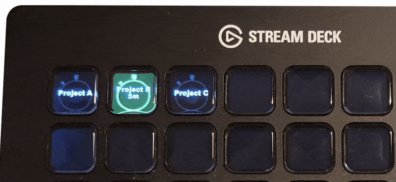
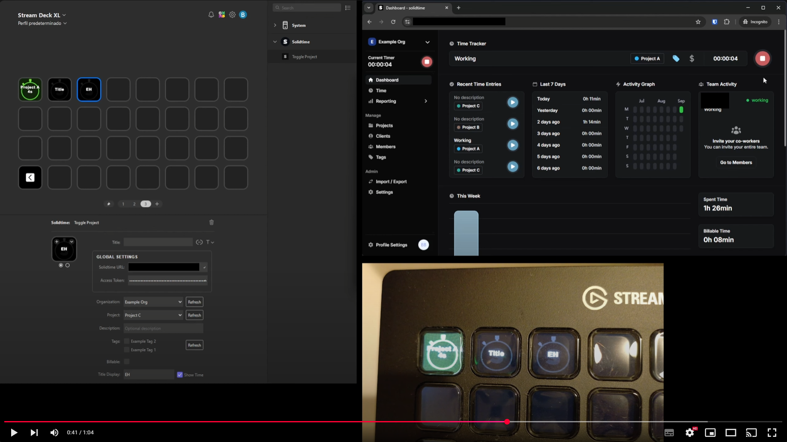

# Solidtime for Stream Deck

> Control your Solidtime project timers with Stream Deck keys. Quickly switch between what you are working on.



## How to use

1. Install the plugin from the Elgato Marketplace.
2. Enter your Solidtime base URL and API Token. In Solidtime go to Profile Settings/**Create API Token**.
3. Assign a project to a key and press it to start or stop tracking time.

## Features

[](https://www.youtube.com/watch?v=-RmgRb7lD84 "Plugin demo")


- Start/stop project timers with one key press.
- Assign different projects or organizations per key.
- See running status and elapsed time on your Stream Deck.
- Add tags and descriptions directly when starting a timer.

## Requirements

- Stream Deck app 6.5 or newer (Windows 10 / macOS 12 or later).
- A Solidtime account.

## Run locally

If you want to modify or run the plugin locally:

1. Clone this repository.

2. Install dependencies:

   ```bash
   npm install
   ```

3. Build the plugin:

   ```bash
   npm run build
   ```

4. Or run in watch mode (auto-build and restart Stream Deck):

   ```bash
   npm run watch
   ```

5. The built plugin is output to the `com.benjavides.solidtime-deck.sdPlugin` folder. Load it with the [Elgato CLI](https://www.npmjs.com/package/@elgato/cli) or by placing it in your Stream Deck plugins directory.